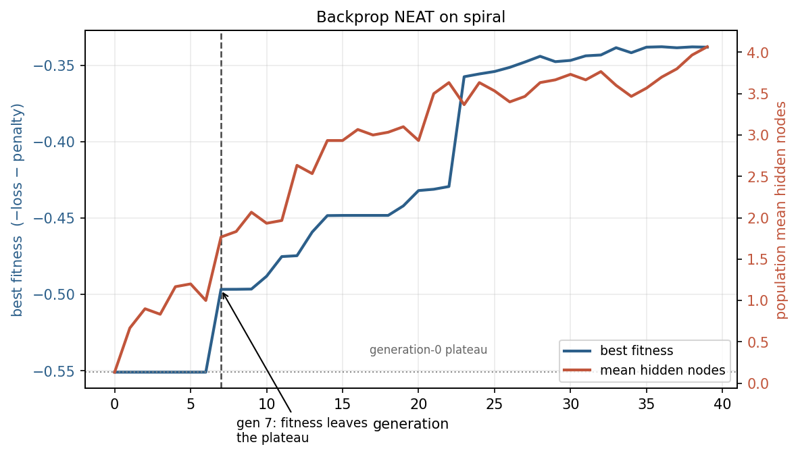

# NEAT in JAX

An implementation of **NEAT** (NeuroEvolution of Augmenting Topologies) written in JAX, applied to two problems:

1. **Neural Slime Volleyball**. Evolve an agent from scratch to play against the built-in AI from [EvoJAX](https://github.com/google/evojax), starting from a network with no hidden nodes at all.
2. **Backpropagation NEAT**. NEAT evolution proposes network topologies, gradient descent fits their weights, on four 2-dimensional classification tasks from [backprop-neat-js](https://github.com/hardmaru/backprop-neat-js/).

Everything here is written directly on top of `jax` and `numpy`: the genome encoding, the forward pass, mutation, crossover, speciation and the selection loop. There is no NEAT library underneath.

---

## What is NEAT?

NEAT is a genetic algorithm used to evolve both the weights and the topology of neural networks. It was developed by Kenneth Stanley and Risto Miikkulainen in 2002.

A NEAT agent comprises a population of individuals (or genomes); each individual is a feed-forward neural network, consisting of nodes and weighted connections between nodes. One generation in NEAT looks as follows:
1. Express and evaluate all the individuals in a NEAT agent based on the inputs (a collection of real numbers); then record the outputs (another collection of real numbers), which determine a fitness score based on a fitness function adapted to the task at hand.
2. Speciate. Group individuals by compatibility distance based on the similarity of their genomes, which protects diversity and innovation.
3. Select and reproduce. Within species, fitter individuals produce offspring via crossover
4. Mutate, in two different ways:
    1) Perturb weights with some moderate randomness.
    2) Occasionally add a node or connection, stamping new innovation numbers.
5. Repeat, with networks gradually complexifying (ideally, only where added structure improves fitness).

One of the innovations of NEAT is the use of innovation numbers, which are unique historical markers associated to connection genes which track when said connection first appears, enabling correct crossover (when two genomes mate, their genes must be properly aligned) and accurate speciation (to protect innovation).

In some sense, NEAT starts with the simplest possible networks and lets a genetic algorithm grow them (both weights and topologies) in such a way that complexity accumulates only when it helps. 

---

## Why JAX

The awkward part of NEAT is that every genome has a different network. That normally forces you to evaluate the population one genome at a time, which is where most of the runtime goes.

The use of JAX, with its immutable data structures allowing jitted functions, enables faster evaluation of the NEAT algorithmic loop. Nonetheless, using JAX has some drastic consequences, since many of the data structures are not allowed to be modified.

Therefore, I decided to split my NEAT algorithm into two connected parts:

1. The JAX side: evaluating the population’s fitness (aka the forward pass), using vmap/jit, which is the step requiring the most computing power. All functions present in the forward pass need to be JIT compatible, so that I can add a simple @jit decorator at the end.
2. The NumPy side: everything else (speciation, crossover, mutations, restacking the population with new individuals, innovation bookkeeping, etc.). These steps do not vectorize easily so they are not so suitable for JAX (it would take quite a bit more work to rewrite them using JAX).

The trick used throughout this repository is to give every genome the *same fixed-size arrays* and let unused capacity sit in inactive slots. A genome with three hidden nodes and a genome with thirty have identical shapes, so a whole population stacks into one pytree and evaluates under a single `jax.vmap` — one hundred agents playing volleyball simultaneously inside one compiled `lax.scan`.

Two consequences follow from that choice:

- **The forward pass is a fixed-length scan.** There is no topological sort.
  The full activation vector is updated `MAX_NODES` times; since mutation only
  ever adds edges pointing from a shallower node to a deeper one, the graph is
  acyclic and has certainly settled by then.
- **The forward pass is differentiable.** Which is what makes backprop NEAT
  almost free: `jax.grad` on the same code that plays volleyball.

Mutation and speciation, by contrast, stay in NumPy. They run once per offspring per generation.

---

## Install

```bash
git clone https://github.com/<you>/neat-jax.git
cd neat-jax
pip install -r requirements.txt
```

CPU JAX is fine for both experiments. For a GPU build, follow the
[official JAX install instructions](https://docs.jax.dev/en/latest/installation.html)
instead of the `jax` line in `requirements.txt`.

`evojax` is only needed for Slime Volleyball. The classification experiment
runs without it.

Note that EvoJAX's Slime Volleyball module imports `cv2` for rendering but does
not list it among its own dependencies, so `opencv-python` is pinned here
explicitly. Installing `evojax` on its own is not enough.

---

## Quick start

```bash
# Backprop NEAT on all four classification tasks (~40 min on one CPU core)
python train_classification.py

# A fast look at what it does
python train_classification.py --gens 10 --datasets xor spiral

# Slime Volleyball (long — see "Runtime" below)
python train_slimevolley.py

# A fast look
python train_slimevolley.py --gens 20 --pop 20 --episodes 1 \
    --set N_ELITES=2 --set MAX_STEPS=300 --set GIF_EVERY=10
```

Both scripts write everything to `--out` (default `outputs/<task>/`) and print
a per-generation log as they go.

---

## What you get out

### `train_slimevolley.py`

| File | Contents |
| --- | --- |
| `best_gen####.gif` | the champion playing a full match against the built-in AI |
| `best_gen####.npz` | that champion's genome, reloadable with `load_genome` |
| `topology_gen####.png` | its network, drawn left-to-right by depth |
| `fitness.png` | best episode reward against generation |

GIFs and checkpoints are written every `GIF_EVERY` generations, topology
figures every `SNAPSHOT_EVERY`.

At the end the script re-scores **every** checkpoint on the same fresh
episodes and reports the best. This is worth doing rather than trusting the
final generation: a champion selected on three noisy episodes can simply have
had a lucky draw, and the last generation is not reliably the strongest one.

### `train_classification.py`

| File | Contents |
| --- | --- |
| `summary.png` | all datasets at once — decision boundary above, evolved topology below |
| `boundary_<name>.png` | class probability shaded over the plane, with the data on top |
| `topology_<name>.png` | the evolved network, hidden nodes labelled with their activation |
| `fitness_<name>.png` | fitness and mean hidden-node count on twin axes |
| `best_<name>.npz` | the winning genome |

The twin-axis plot is the one worth looking at. Fitness sits flat on the
plateau a linear model can reach, and then jumps — and the jump lines up with
the generation in which the population grows its first hidden node. The script
also prints which activation functions evolution actually kept, pooled across
datasets, which is a reasonable proxy for which ones are useful rather than
merely available.

---

## Results

### Backprop NEAT

All four datasets at stock hyperparameters (40 generations, population 30,
100 points, seed 0), starting from a network with no hidden nodes:

| dataset | accuracy | hidden nodes evolved | activations kept |
| --- | --- | --- | --- |
| gauss | 100% | 1 | inverse |
| circle | 95% | 4 | abs ×3, square |
| xor | 94% | 4 | sin, abs, inverse, cos |
| spiral | 85% | 3 | inverse, sin, cos |


Top row: the learned class probability over the plane, with the 0.5 contour in
black. Bottom row: the network evolution actually produced, hidden nodes
labelled with their chosen activation.

Two things in that figure are worth more than the accuracy column.

**Complexity tracks difficulty.** `gauss` is linearly separable and evolution
stopped at one hidden node; the two non-linear tasks grew four. Nothing in the
fitness function asks for this — the complexity penalty pushes the other way.
It falls out of the search.

**The activation set is used selectively.** Pooling hidden nodes across all
four runs: `abs` 33%, `inverse` 25%, `sin` and `cos` 17% each, `square` 8% —
and `linear`, `tanh`, `sigmoid`, `relu` and `gauss` were never chosen at all.
Uniform choice would be 9% each. The functions that survive are the ones whose
shape matches the task geometry: `abs` and `square` fold the plane around an
axis, which is most of what `circle` and `xor` need.

### Complexification



This is the plot the whole setup exists to produce. Fitness sits pinned on the
generation-0 plateau — the best a network with no hidden layer can do — for
seven generations. It leaves the plateau only once the population has grown its
first hidden node, and every subsequent jump in fitness is preceded by a rise
in mean hidden-node count. Architecture search is doing the work; gradient
descent is only cashing it in.

### Slime Volleyball

Verified mechanically rather than to convergence — see **Runtime** below; the
stock configuration is an overnight job and was not run to completion here.
Structural growth, GIF rendering, topology figures, checkpointing and the
re-scoring loop all behave correctly on short runs.

---

## Changing the hyperparameters

Everything tunable lives in **`neat/config.py`**, as two presets:

```python
PRESETS = {
    "slimevolley":    dict(MAX_NODES=40, POP_SIZE=100, N_GENS=3000, ...),
    "classification": dict(MAX_NODES=20, POP_SIZE=30,  N_GENS=40,   ...),
}
```

Edit those for a permanent change. For a one-off, override any of them from
the command line:

```bash
python train_classification.py --set BP_STEPS=300 --set LEARN_RATE=0.2
python train_slimevolley.py --set PROB_ADD_NODE=0.25 --set COMPAT_THRESHOLD=0.8
```

`--set` validates names against the config module, so a typo fails immediately
instead of being silently ignored. The common knobs also have short flags:
`--gens`, `--pop`, `--episodes`, `--points`, `--seed`.

The parameters worth reaching for first:

| Name | Effect |
| --- | --- |
| `MAX_NODES`, `MAX_CONNS` | genome capacity — the ceiling on how complex a network can get. Raising them costs memory and compile time on *every* genome, since the arrays are fixed-size. |
| `PROB_ADD_NODE`, `PROB_ADD_CONN` | how fast topologies complexify |
| `COMPAT_THRESHOLD` | lower ⇒ more, smaller species. The single most sensitive parameter here: it decides how much protection a new structure gets. |
| `COMPLEXITY_PENALTY` | fitness cost per active connection, annealed to zero over the run for Slime Volleyball |
| `N_ELITES` | genomes copied unchanged each generation. Must be smaller than `POP_SIZE` — if you shrink the population for a quick test, shrink this too. |
| `BP_STEPS`, `LEARN_RATE` | gradient budget per genome per generation (backprop NEAT only) |

Ablations are available as flags on both scripts: `--no-speciation`,
`--no-crossover`, and `--no-structural` (fix the topology, evolve weights
only). Turning speciation off is the informative one — new structures stop
being protected and the population collapses onto whatever works immediately.

---

## Repository layout

```
neat/
  config.py       every hyperparameter, plus the two presets
  genome.py       the Ind genome, activations, forward pass, initialisation, I/O
  mutation.py     weight perturbation, add-connection, add-node, crossover
  speciation.py   compatibility distance, species assignment, fitness sharing
  evolution.py    the generation loop, shared by both experiments
  viz.py          topology figures and training curves
tasks/
  slimevolley.py      policy, batched evaluation, GIF rendering, match scoring
  classification.py   datasets, gradient training, decision-boundary plots
train_slimevolley.py
train_classification.py
```

The two experiments share one `evolve()`. They differ only in how a genome is
scored, which is passed in as a `fitness_fn` callback:

```python
def fitness_fn(pop, pop_size, gen, key) -> (fitness, pop)
```

Returning the population as well as the scores is what lets backprop NEAT
write trained weights back into the genomes — a Lamarckian step, so what
gradient descent learns is inherited rather than rediscovered every
generation. The Slime Volleyball version returns the population untouched.

Adding a third task means writing one such function; none of the selection
machinery needs to change.

---

## Implementation notes

**Genome.** Seven fixed-length arrays: `node_type`, `node_act` over node slots,
and `conn_in`, `conn_out`, `conn_w`, `conn_on`, `conn_innov` over connection
slots. The slot layout is fixed for a whole run — inputs, then the bias node,
then outputs, then free space — so a node index means the same thing in every
genome.

**Innovation numbers.** Structural changes are recorded in a record shared
across the population, so the same mutation arising independently in two
genomes gets the same number. That is what makes genes comparable between
genomes, which crossover and the compatibility distance both depend on.

**Add-node is near-neutral by design.** Splitting `src --w--> dst` into
`src --1--> new --w--> dst` routes the original weight through the second half,
so the new network computes nearly what the old one did. Without this a fresh
node arrives with random weights, immediately loses, and never gets refined.

**Crossover keeps the fitter parent's topology** and, for genes both parents
share, takes the other parent's weight with probability `PROB_INHERIT_B`.
Reconciling two different node layouts inside fixed-size arrays is not worth
the complexity for the gain.

**Speciation** is what makes complexification survivable. A new hidden node
almost always hurts before it helps, so genomes compete mainly against
relatives, and fitness sharing stops any one species from taking over.

**Backprop NEAT** excludes the step function from the activations a new hidden
node may take, since its gradient is zero wherever it is defined. Weights are
clipped during descent — some evolved topologies diverge otherwise — and a
genome whose training produced a non-finite loss is mapped to a very bad
fitness rather than a `NaN`, so one blown-up architecture cannot poison the
whole generation.

---

## Runtime

Measured on a **single CPU core**; a multi-core machine or a GPU is
substantially faster, since the population evaluates in parallel.

| Run | Rough cost |
| --- | --- |
| `train_classification.py` (defaults: 4 datasets × 40 gens × pop 30) | ~40 min |
| `train_classification.py --gens 10 --datasets xor` | ~2 min |
| `train_slimevolley.py` (defaults: 3000 gens × pop 100 × 1000 steps) | hours — this is an overnight run |
| `train_slimevolley.py --gens 20 --pop 20 --episodes 1 --set MAX_STEPS=300` | ~5 min |

The first generation of either script includes JAX compilation, so it is
noticeably slower than the rest. Slime Volleyball is the expensive one: cost
scales with `POP_SIZE × N_EPISODES × MAX_STEPS`, and reducing `N_EPISODES`
makes fitness noisier rather than making the run cheaper for free.

---

## References

- Stanley & Miikkulainen, *Evolving Neural Networks through Augmenting
  Topologies*, Evolutionary Computation 10(2), 2002 — the original NEAT paper.
- David Ha, *Backprop NEAT* (2017) — evolving architectures while training
  weights by gradient descent, on the TensorFlow Playground datasets that
  `make_dataset` reproduces here.
- [EvoJAX](https://github.com/google/evojax) — supplies the vectorised
  Slime Volleyball environment, itself derived from David Ha's
  `slimevolleygym`.

## License

MIT
