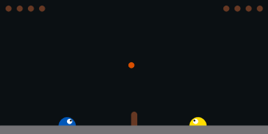
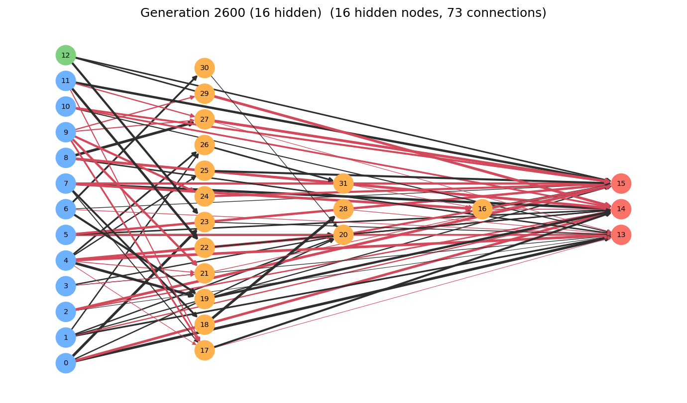
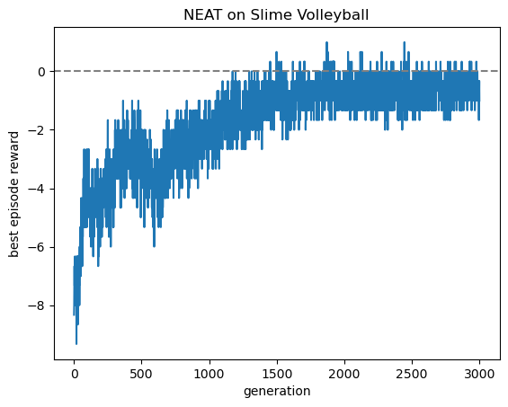
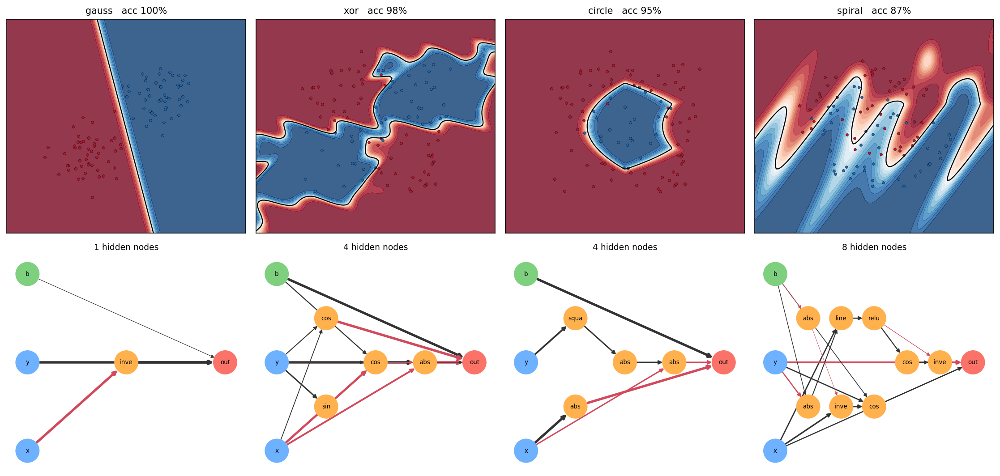

# NEAT in JAX (a personal side project)

An implementation of **NEAT** (NeuroEvolution of Augmenting Topologies) written in JAX, applied to two problems:

1. **Neural Slime Volleyball**. Evolve an agent from scratch to play against the built-in AI from [EvoJAX](https://github.com/google/evojax), starting from a minimal fully-connected network with no hidden nodes.
2. **Backpropagation NEAT**. NEAT evolution proposes network topologies, gradient descent fits their weights, on four 2-dimensional classification tasks from [backprop-neat-js](https://github.com/hardmaru/backprop-neat-js/).

Everything here is written directly on top of `jax` and `numpy`: the genome encoding, the forward pass, mutation, crossover, speciation and the selection loop. There is no NEAT library underneath.

---

## What is NEAT?

NEAT is a genetic algorithm used to evolve both the weights and the topology of neural networks. It was developed by Kenneth Stanley and Risto Miikkulainen in 2002.

A NEAT agent comprises a population of individuals (or genomes); each individual is a feed-forward neural network, consisting of nodes and weighted connections between nodes. One generation in NEAT looks as follows:

1. **Express and evaluate** all the individuals in a NEAT agent based on the inputs (a collection of real numbers); then record the outputs (another collection of real numbers), which determine a fitness score based on a fitness function adapted to the task at hand.
2. **Speciate**. Group individuals by compatibility distance based on the similarity of their genomes, which protects diversity and innovation.
3. **Select and reproduce**. Within species, fitter individuals produce offspring via crossover
4. **Mutate**, in two different ways:
    1) Perturb weights with some moderate randomness.
    2) Occasionally add a node or connection, stamping new innovation numbers.
5. **Repeat**, with networks gradually complexifying (ideally, only where added structure improves fitness).

One of the innovations of NEAT is the use of innovation numbers, which are unique historical markers associated to connection genes which track when said connection first appears, enabling correct crossover (when two genomes mate, their genes must be properly aligned) and accurate speciation (to protect innovation).

In some sense, NEAT starts with the simplest possible networks and lets a genetic algorithm grow them (both weights and topologies) in such a way that complexity accumulates only when it helps. 

---

## Why JAX?

The awkward part of NEAT is that every genome has a different network. That normally forces you to evaluate the population one genome at a time, which is where most of the runtime goes.

The use of JAX, with its immutable data structures allowing jitted functions, enables faster evaluation of the NEAT algorithmic loop. Nonetheless, using JAX has some drastic consequences, since many of the data structures are not allowed to be modified.

The trick used throughout this repository is to give every genome the same fixed-size arrays and let unused capacity sit in inactive slots. A genome with three hidden nodes and a genome with thirty have identical shapes, so a whole population stacks into one pytree and evaluates under a single `jax.vmap`. The whole population of individuals then get evaluated simultaneously inside one compiled `lax.scan`.

Therefore, I decided to split my NEAT algorithm into two connected parts:

1. **The JAX side**: evaluating the population’s fitness (aka the forward pass), using vmap/jit, which is the step requiring the most computing power. All functions present in the forward pass need to be JIT compatible, so that I can add a simple @jit decorator at the end.
2. **The NumPy side**: everything else (speciation, crossover, mutations, restacking the population with new individuals, innovation bookkeeping, etc.). These steps do not vectorize easily so they are not so suitable for JAX (it would take quite a bit more work to rewrite them using JAX). These steps run once per offspring per generation.

Two consequences follow from this choice:

- **The forward pass is a fixed-length scan.** There is no topological sort. The full activation vector is updated `MAX_NODES` times; since mutation only ever adds edges pointing from a shallower node to a deeper one, the graph is acyclic and has certainly settled by then.
- **The forward pass is differentiable.** Which is what makes backprop NEAT almost free using `jax.grad`.

Backprop NEAT splits the labor: NEAT for figuring out new architectures, while backpropagation for determining weights. Gradient descent is better at fitting weights than random mutations when there is a differentiable objective. On the other hand, architecture search has no gradient.

See [implementation-notes.md](implementation-notes.md) for a description of the different parts of my implementation of NEAT.

---

## Install

CPU JAX is fine for both experiments. For a GPU build, follow the [official JAX install instructions](https://docs.jax.dev/en/latest/installation.html) instead of the `jax` line in `requirements.txt`.

`evojax` is only needed for Slime Volleyball. The classification experiment runs without it.

Note that EvoJAX's Slime Volleyball module imports `cv2` for rendering but does not list it among its own dependencies, so `opencv-python` is pinned here explicitly. Installing `evojax` on its own is not enough.

---

## Quick start

```bash
# Backprop NEAT on all four classification tasks
python train_classification.py

# A fast look at what it does
python train_classification.py --gens 10 --datasets xor spiral

# Slime Volleyball (long runtime)
python train_slimevolley.py

# A fast look
python train_slimevolley.py --gens 20 --pop 20 --episodes 1 --set N_ELITES=2 --set MAX_STEPS=300 --set GIF_EVERY=10
```

Both scripts write everything to an output folder (default `outputs/<task>/`) and print a per-generation log as they go.

---

## Outputs

### `train_slimevolley.py`

| File | Contents |
| --- | --- |
| `best_gen####.gif` | the champion playing a full match against the built-in AI |
| `best_gen####.npz` | that champion's genome, reloadable with `load_genome` |
| `topology_gen####.png` | its network, drawn left-to-right by depth |
| `fitness.png` | best episode reward against generation |

GIFs and checkpoints are written every `GIF_EVERY` generations, topology figures every `SNAPSHOT_EVERY` generations.

At the end the script re-scores every checkpoint on the same fresh episodes and reports the best.

### `train_classification.py`

| File | Contents |
| --- | --- |
| `summary.png` | all datasets at once — decision boundary above, evolved topology below |
| `boundary_<name>.png` | class probability shaded over the plane, with the data on top |
| `topology_<name>.png` | the evolved network, hidden nodes labelled with their activation |
| `fitness_<name>.png` | fitness and mean hidden-node count on twin axes |
| `best_<name>.npz` | the winning genome |

---

## Sample results

### Slime Volleyball

A winning genome:







In the GIF, my NEAT evolved agent is the yellow one on the right; the internal AI from EvoJAX is the blue one on the left.

Examining GIFs from later generations, I realized that my NEAT agents were gaming me! More precisely, I realized that my agents became very good at keeping the ball in play, but they were not trying to win. One reason for this is that I am not running full games in my evolutionary loop, but instead I am running games of a fixed time interval. This benefitted agents which did not lose any points. Perhaps this suggests that the complexity of keeping the ball in play is lower than the complexity of actively trying to score points.

### Backprop NEAT



In the figure above, notice how the activation functions that survive are the ones that match the geometry of the task. Also, the complexity of the task is directly proportional to the number of hidden nodes.


---

## Changing the hyperparameters

Everything tunable lives in **`neat/config.py`**, as two presets:

```python
PRESETS = {
    "slimevolley":    dict(MAX_NODES=40, POP_SIZE=100, N_GENS=3000, ...),
    "classification": dict(MAX_NODES=20, POP_SIZE=30,  N_GENS=40,   ...),
}
```

Edit those for a permanent change. For a one-off, override any of them from
the command line:

```bash
python train_classification.py --set BP_STEPS=300 --set LEARN_RATE=0.2
python train_slimevolley.py --set PROB_ADD_NODE=0.25 --set COMPAT_THRESHOLD=0.8
```

Some of the common parameters: `--gens`, `--pop`, `--episodes`, `--points`, `--seed`.

Description of the main parameters:

| Name | Effect |
| --- | --- |
| `MAX_NODES`, `MAX_CONNS` | Genome capacity (maximum number of nodes and connections), i.e. the ceiling on how complex a network can get. Raising them costs memory and compile time on every genome, since the arrays are fixed-size. |
| `PROB_ADD_NODE`, `PROB_ADD_CONN` | How fast topologies complexify |
| `COMPAT_THRESHOLD` | Lower leads to more, smaller species. It decides how much protection a new structure gets. |
| `COMPLEXITY_PENALTY` | Fitness cost per active connection, annealed to zero over the run for Slime Volleyball |
| `N_ELITES` | Genomes copied unchanged each generation. Must be smaller than `POP_SIZE`. |
| `BP_STEPS`, `LEARN_RATE` | Gradient budget per genome per generation (for backprop NEAT only) |

Also available: `--no-speciation`, `--no-crossover`, and `--no-structural` (fix the topology, evolve weights only). Turning speciation off makes new structures stop being protected, so the population collapses onto whatever works immediately.

---

## Repository layout

```
neat/
  config.py       every hyperparameter, plus the two presets
  genome.py       the Ind genome, activations, forward pass, initialisation
  mutation.py     weight perturbation, add-connection, add-node, crossover
  speciation.py   compatibility distance, species assignment, fitness sharing
  evolution.py    the generation loop, shared by both experiments
  viz.py          topology figures and training curves
tasks/
  slimevolley.py      
  classification.py   
train_slimevolley.py
train_classification.py
```

The two experiments share one `evolve()` function. They differ only in how a genome is scored, which is passed in as a `fitness_fn`:

```python
def fitness_fn(pop, pop_size, gen, key) -> (fitness, pop)
```

---

## Runtime

Measured on a **single CPU core**; a multi-core machine or a GPU is
substantially faster, since the population evaluates in parallel.

| Run | Rough cost |
| --- | --- |
| `train_classification.py` (defaults: 4 datasets × 40 gens × pop 30) | ~40 min |
| `train_classification.py --gens 10 --datasets xor` | ~2 min |
| `train_slimevolley.py` (defaults: 3000 gens × pop 100 × 1000 steps) | a few hours  |
| `train_slimevolley.py --gens 20 --pop 20 --episodes 1 --set MAX_STEPS=300` | ~5 min |

The first generation of either script includes JAX compilation, so it is
noticeably slower than the rest. Slime Volleyball is the expensive one: cost
scales with `POP_SIZE × N_EPISODES × MAX_STEPS`, and reducing `N_EPISODES`
makes fitness noisier rather than making the run cheaper for free.

---

## References

- Stanley & Miikkulainen, *Evolving Neural Networks through Augmenting
  Topologies*, Evolutionary Computation 10(2), 2002 — the original NEAT paper.
- David Ha, *Backprop NEAT* (2017) — evolving architectures while training
  weights by gradient descent, on the TensorFlow Playground datasets that
  `make_dataset` reproduces here.
- [EvoJAX](https://github.com/google/evojax) — supplies the vectorised
  Slime Volleyball environment, itself derived from David Ha's
  `slimevolleygym`.

## License

MIT
